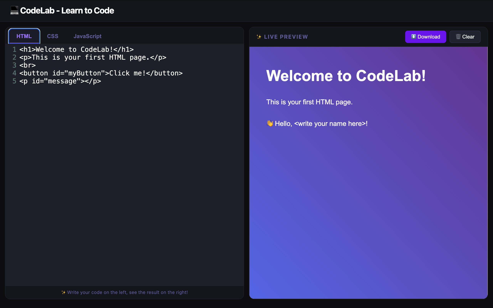

# CodeLab - A Simple Online Code Editor

[**Live Demo**](https://pinkish-warrior.github.io/CodeLab/)

CodeLab is a simple and intuitive online code editor for HTML, CSS, and JavaScript. It's a great tool for beginners to learn and experiment with web development. You can write your code and see the live preview instantly.



## ✨ Features

*   **Live Preview:** See the results of your code in real-time.
*   **Zero-Installation:** Runs directly in the browser with no build step required, thanks to CDN-hosted dependencies.
*   **Syntax Highlighting:** Code is highlighted for better readability, powered by CodeMirror.
*   **Automatic Indentation:** The editor automatically indents your code as you type.
*   **Full Document Formatting:** Format the entire document with a simple keyboard shortcut.
*   **Tabbed Editor:** Switch between HTML, CSS, and JavaScript files easily.
*   **Download Your Code:** Download your project as a single `index.html` file.
*   **Clear Code:** Clear the editor with a single click.
*   **Modern UI:** A clean and modern user interface with a dark theme.

## 🚀 How to Use (Locally)

1.  Clone this repository to your local machine.
    ```bash
    git clone https://github.com/Pinkish-Warrior/CodeLab.git
    ```
2.  Navigate into the cloned directory.
    ```bash
    cd CodeLab
    ```
3.  Open the `index.html` file in your browser.
4.  That's it! You can start coding right away. No installation (`npm install`) is needed.

## 🚢 Deployment

This project is configured for easy deployment to GitHub Pages. The setup uses CDN for all dependencies, so no build process is necessary. Any push to the `main` branch that includes changes to the deployed files (`index.html`, `favicon_io/`) will require a manual run of `npm run deploy` to update the live demo page.

## ⌨️ Keyboard Shortcuts

| Shortcut                | Description                     |
| ----------------------- | ------------------------------- |
| `Tab`                   | Indent the current line or selection. |
| `Shift` + `Tab`         | Outdent the current line or selection. |
| `Ctrl` + `I` / `Cmd` + `I` | Format the entire document.     |

## 🤝 How to Contribute

We welcome contributions from everyone! If you are a beginner, this is a great project to get your feet wet with open-source.

Here are some ways you can contribute:
*   **Report Bugs:** If you find a bug, please open an issue and let us know.
*   **Suggest Enhancements:** Have an idea to improve CodeLab? Open an issue and share your thoughts.
*   **Submit Pull Requests:** If you want to contribute with code, please fork the repository and submit a pull request.

## 📝 License

This project is licensed under the **Creative Commons BY-NC-SA 4.0 License**. This means you are free to use, share, and adapt it for non-commercial purposes, but you must give appropriate credit.

See the [LICENSE](LICENSE) file for full details.
